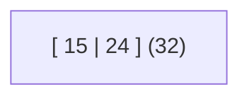
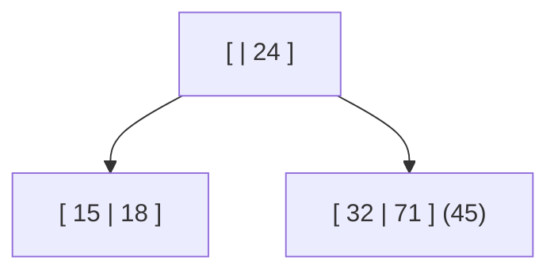
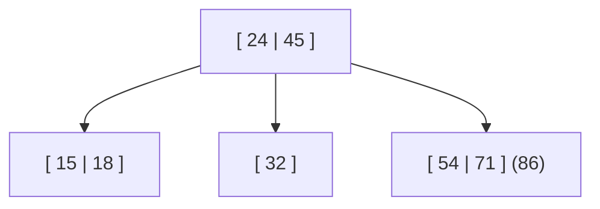
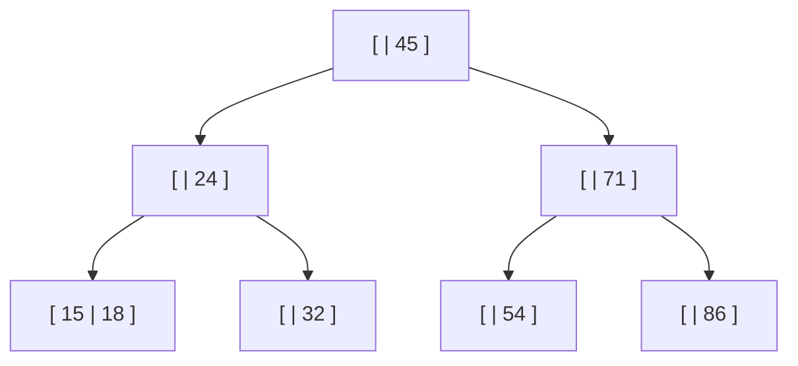
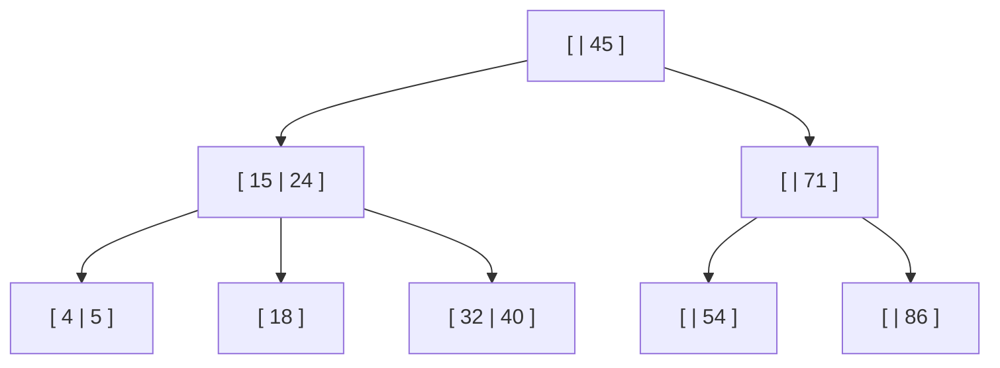
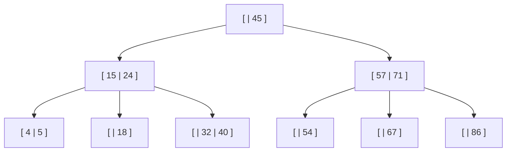
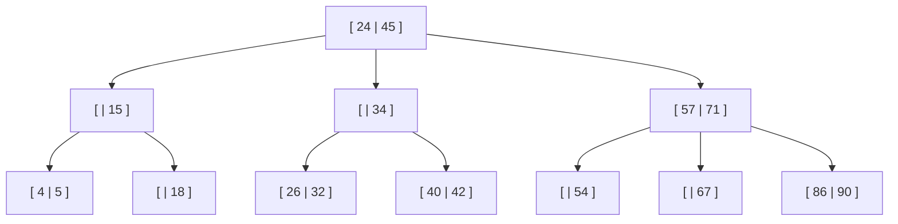

> Ejercicio realizado en la clase del 01/07/26
**Secuencia:** 15, 24, 32, 71, 18, 45, 54, 86, 5, 4, 40, 57, 67, 34, 90, 42, 26

----
### 1. Inserción del 15, 24 y 32
Se insertan las claves `15` y `24` en la raíz.

Al intentar insertar `32`, el nodo ya está completo, por lo que se produce un **overflow**.

---
### 2. División de la raíz
Como consecuencia del overflow anterior, la raíz se divide.

La clave central (`24`) asciende y se crea una nueva raíz. Las claves menores quedan en el hijo izquierdo y las mayores en el derecho.

Luego se inserta el `18` sin problema.

---
### 3. División del hijo derecho
Al intentar insertar `45`, el hijo derecho ya está completo y se produce un overflow.

La clave central (`45`) asciende hacia la raíz, dividiendo el nodo en dos hijos.

---
### 4. División de la raíz
Después de insertar `54`, al intentar insertar `86` el hijo derecho vuelve a desbordarse.

La promoción de la clave central provoca que la raíz también quede llena, por lo que la raíz se divide y `45` pasa a ser la nueva raíz del árbol.

Es el mismo criterio para los demás

---

---

---

