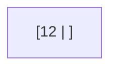
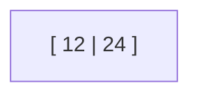
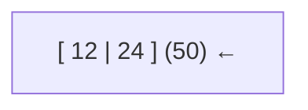
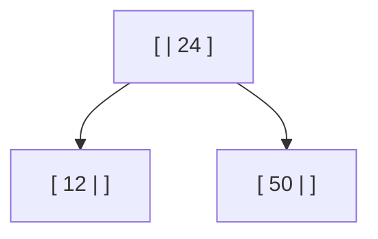
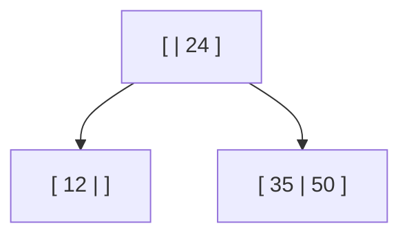
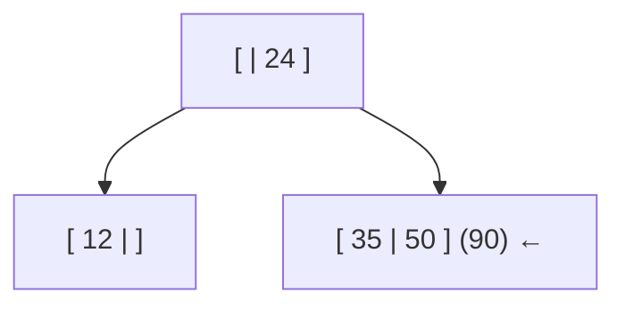
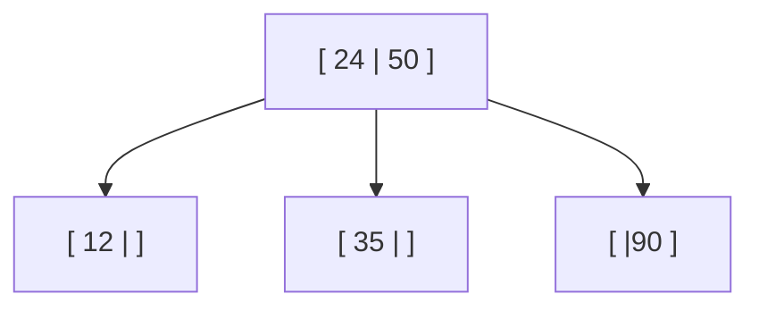
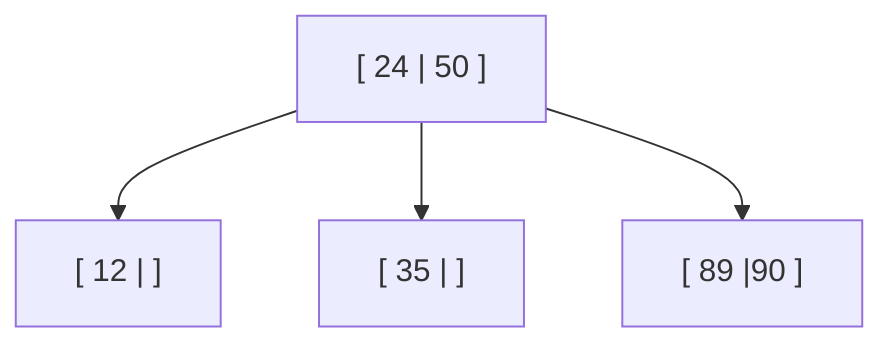
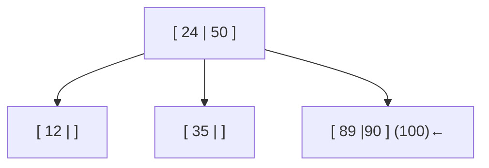
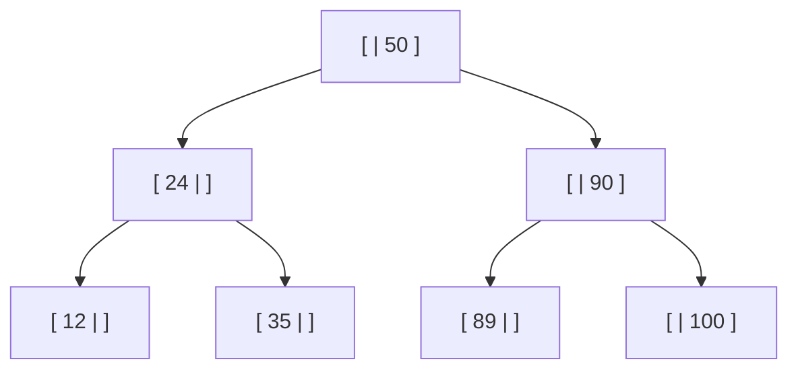

# Árboles 2-3

Secuencia de ejemplo: 12, 24, 50, 35, 90, 89, 100, 1, 0, 14, 7, 6, 40, 70, 55

Vamos a ir paso a paso. Primero vamos a insertar el primer número de la secuencia (en este caso 12)

Ahora insertamos el 24. Como es mayor al 12, lo insertamos a su derecha

Insertamos el 50. Como vemos, el nodo está lleno. Al intentar insertar el 50 se genera una partición. El 50 va a la derecha del 24 ya que es mayor a dicho número. Siempre que se genera una partición, sube el número del medio (eso es importante, en árbol 2-3 los nodos suben **nunca bajan**)

Entonces:

Ahora insertamos el 35. Como es mayor que 24 y hay espacio en el nodo donde se ubica el 50, se colocará en dicho nodo

Insertamos el 90. Daado que el nodo donde se encuenta el 35 y 50 está lleno, sucede otra partición.

El número 50 sube, y como hay espacio en el nodo de arriba, se pone junto al 24

¿Cómo sabemos si está bien lo que hicimos hasta ahora? Hay que fijarnos en los números. Los número dispuestos a la izquierda de otro son menores y los de la derecha son mayores. Teniendo en cuenta esa lógica, podemos comprobar viendo si se cumple eso.
- 12 está a la izquierda de 24. 12 < 24
- 35 está en el medio. 24 < 35 < 50
- 90 está a la derecha de 50. 50 < 90

Con eso podemos comprobar que estamos haciendo bien
Ahora insertamos el 89 siguiendo la misma lógica

Insertamos el 100.

Si se analizan los nodos, nos podemos percatar que van a ocurrir dos particiones ¿Por qué? Porque el nodo donde se intenta insertar el 100 está lleno, y cuando sube el 90, el nodo de arriba también está lleno, entonces también se parte.

¿Cómo quedaría?

